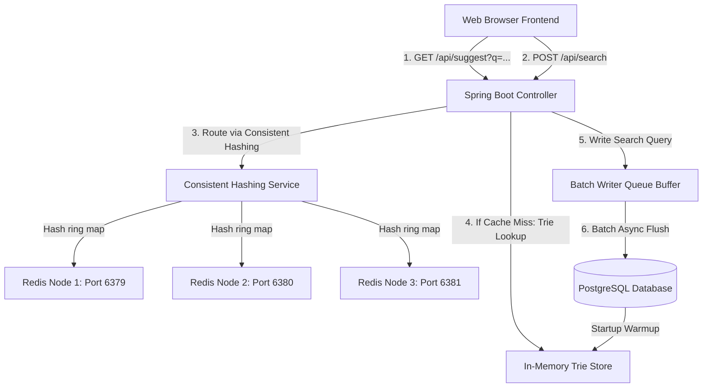

# Distributed Search Typeahead & Autocomplete System

A high-performance, production-ready Distributed Search Typeahead and Autocomplete system built with Spring Boot, PostgreSQL, and a distributed Redis caching layer. The system features a recency-aware ranking mechanism, write reduction buffering, and a real-time diagnostics dashboard.

---

## 🏗️ System Architecture



### Key Architectural Components

1. **In-Memory Trie Index**: On startup, the system warms up by loading historical search records from PostgreSQL into an in-memory Trie data structure, enabling sub-millisecond autocomplete prefix lookups.
2. **Distributed Caching (Consistent Hashing)**: A customized consistent hashing ring distributes prefix autocomplete results across a cluster of 3 Redis nodes (ports 6379, 6380, and 6381). Virtual nodes (default 160 per physical node) ensure even load distribution and graceful scaling if cache nodes are added or removed.
3. **Recency-Aware Trending**: Suggestions and trending queries are sorted by a dynamically calculated trending score that prioritizes recent search activity over historical counts:
   $$\text{Trending Score} = 0.7 \times \text{Recent Count} + 0.3 \times \text{Total Count}$$
   An automatic background task runs every 10 seconds to apply **exponential decay** (decay factor `0.9`) to recent counts, causing old search spikes to naturally fade.
4. **Write-Reduction Buffering**: Instead of writing every search query directly to the database, search requests are placed into a high-concurrency memory queue. A background thread flushes updates in batches every 5 seconds, reducing database disk I/O operations by up to 90%+.
5. **Diagnostics Dashboard**: Visualizes live latency diagnostics (average & P95 suggestion latency), database write reduction efficiency, search volume, and cache hit rates in real-time.

---

## ⚙️ Prerequisites

To run this application locally, you will need:
- **Java Development Kit (JDK) 21**
- **Docker** and **Docker Compose**
- A running **PostgreSQL** instance (or cloud provider like Neon PostgreSQL)

---

## 🚀 Getting Started

### 1. Spin up the Redis Cluster
Use the provided `docker-compose.yml` to launch three independent Redis instances:
```bash
docker-compose up -d
```
This spins up:
- **Redis 1** on `localhost:6379`
- **Redis 2** on `localhost:6380`
- **Redis 3** on `localhost:6381`

### 2. Database Configuration
Configure your PostgreSQL connection settings in `src/main/resources/application.properties`:
```properties
spring.datasource.url=jdbc:postgresql://<host>:<port>/<database>?sslmode=require
spring.datasource.username=<username>
spring.datasource.password=<password>
```

### 3. Build and Run the App
Run the Spring Boot application using the Maven wrapper:

**On Windows (PowerShell):**
```powershell
$env:JAVA_HOME="C:\Program Files\Java\jdk-21.0.10" # or your local JDK 21 path
.\mvnw.cmd spring-boot:run
```

**On Linux / macOS:**
```bash
./mvnw spring-boot:run
```

The application will start, automatically warmup the Trie/Cache from the database, and bind to port **`8081`**.

---

## 🖥️ Using the Application

Open your browser and navigate to **`http://localhost:8081/`** to interact with the search console.

1. **Prefix Autocomplete**: Type in the search box. The dropdown list will automatically fetch and display matching prefixes sorted by their dynamic trending scores.
2. **Search Queries**: Type a term and press **Enter** or click **Search**. This submits a search request, queues it in the batch buffer, and increments its trending counts.
3. **Live Diagnostics**: The metrics dashboard at the bottom displays real-time statistics. Click **Refresh Metrics** to pull the latest stats.

---

## 🔌 API Reference

### Autocomplete Suggestions
* **Endpoint**: `GET /api/suggest`
* **Query Params**: `q` (search prefix)
* **Response**: Json Array of strings
* **Example**: `/api/suggest?q=am` -> `["amazon", "amazing", "amd"]`

### Submit Search
* **Endpoint**: `POST /api/search`
* **Body**: `{"query": "search term"}`
* **Response**: `{"message": "Searched"}`

### Trending Queries
* **Endpoint**: `GET /api/trending`
* **Response**: List of trending terms with computed scores and total counts.
* **Example**:
  ```json
  [
    { "query": "amazon", "score": 24.3, "count": 50 },
    { "query": "amazing", "score": 8.7, "count": 15 }
  ]
  ```

### Live Performance Metrics
* **Endpoint**: `GET /api/metrics`
* **Response**: Current system performance indicators.
* **Example**:
  ```json
  {
    "cacheHitRatePercent": "85.20%",
    "averageSuggestLatencyMs": "1.45 ms",
    "p95SuggestLatencyMs": "4 ms",
    "totalSearchRequestsSubmitted": 150,
    "writeReductionPercent": "92.00%"
  }
  ```
